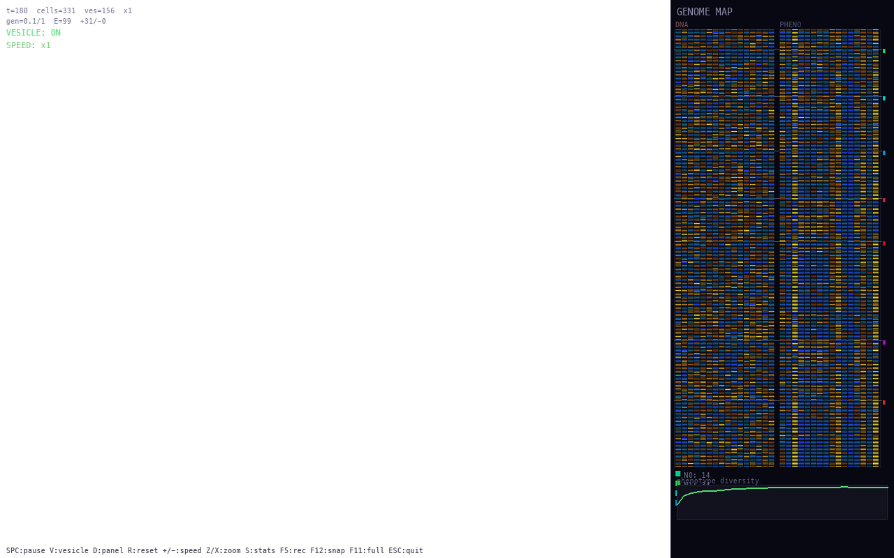

# ALife Vesicle — Transformer-Brained Artificial Life with Vesicle Communication

**Transformer脳と小胞通信による人工生命シミュレータ**



An artificial life simulator where each cell carries a Transformer-based neural "brain" that perceives neighbors and nearby vesicles through multi-head self-attention. Cells communicate by emitting and absorbing vesicles -- tiny packets of state vectors that drift through the world. A nutrient ecology with depletion and regeneration drives selection, while aging, crowding pressure, and mutation shape long-term evolution.

各セルがTransformerベースのニューラル「脳」を持ち、マルチヘッド自己注意機構で近傍セルや小胞(vesicle)を知覚する人工生命シミュレータです。セルは状態ベクトルを運ぶ小胞を放出・吸収することで互いに通信します。栄養源の枯渇と再生が選択圧を生み出し、老化・密集圧・突然変異が長期的な進化を形作ります。

---

## Quick Start / クイックスタート

```bash
git clone https://github.com/ochyai/alife-vesicle.git
pip install -r requirements.txt
python main.py
```

> Runs on CPU only (PyTorch). A GPU is not required.
>
> CPU上で動作します（PyTorch）。GPUは不要です。

---

## Architecture / アーキテクチャ

The simulation is organized into three core classes:

シミュレーションは3つのコアクラスで構成されています。

### `Brain` (nn.Module) — Transformer Neural Controller / Transformerニューラルコントローラ

Each cell shares a single `Brain` network (batched inference over all living cells). The brain receives a token sequence:

各セルは単一の`Brain`ネットワークを共有します（全生存セルに対するバッチ推論）。脳はトークン列を受け取ります。

| Position | Token | Description |
|----------|-------|-------------|
| 0 | Self | Cell's own state + genome projection |
| 1--6 | Neighbors | States of 6 nearest cells (with relational features) |
| 7--9 | Vesicles | Contents of up to 3 nearby vesicles |

The brain outputs an action vector: movement (dx, dy), vesicle emission probability, state blending factor (alpha), and vesicle content to emit.

脳は行動ベクトルを出力します：移動(dx, dy)、小胞放出確率、状態ブレンド係数(alpha)、放出する小胞の内容。

### `World` — Simulation Engine / シミュレーションエンジン

Fully tensorized simulation managing:

完全テンソル化されたシミュレーションエンジン：

- **Cell pool** (max 700): position, velocity, state, genome, energy, age, generation
- **Vesicle pool** (max 3,000): position, velocity, content vector, lifetime
- **Nutrient sources** (max 64): position, signature, energy with depletion/regeneration
- **セルプール**（最大700）：位置、速度、状態、ゲノム、エネルギー、年齢、世代
- **小胞プール**（最大3,000）：位置、速度、内容ベクトル、寿命
- **栄養源**（最大64）：位置、シグネチャ、枯渇/再生を伴うエネルギー

### `Ren` — Pygame Renderer / Pygameレンダラー

Real-time visualization featuring:

リアルタイム可視化：

- Transparent "lens" cells with organic polygon membranes that deform along velocity
- Vesicle streaks with tapered trails
- Cloudy nutrient zone sprites with pulsing animation
- DNA barcode panel showing genome and phenotype side by side
- Phenotype diversity graph
- Dynamic LOD (Level of Detail) for performance scaling
- 速度方向に変形する有機的な多角形膜を持つ透明な「レンズ」セル
- テーパー付きトレイルを持つ小胞の軌跡
- 脈動アニメーション付きの雲状栄養ゾーンスプライト
- ゲノムと表現型を並べて表示するDNAバーコードパネル
- 表現型多様性グラフ
- パフォーマンススケーリングのための動的LOD（Level of Detail）

---

## Controls / 操作方法

| Key | Action | 操作 |
|-----|--------|------|
| `Space` | Pause / Resume | 一時停止 / 再開 |
| `V` | Toggle vesicle communication | 小胞通信の切替 |
| `D` | Toggle side panel | サイドパネルの切替 |
| `R` | Reset simulation | シミュレーションのリセット |
| `+` / `-` | Increase / Decrease speed (1x--20x) | 速度の増減（1x--20x） |
| `Z` / `X` | Zoom in / Zoom out (0.5x--3x) | ズームイン / ズームアウト |
| `Scroll` | Scroll wheel zoom | ホイールズーム |
| `Mid-drag` | Pan camera | カメラパン |
| `S` | Toggle stats overlay (FPS, memory, timing) | 統計オーバーレイの切替 |
| `F5` | Start / Stop recording (PNG frames) | 録画の開始 / 停止 |
| `F12` | Save screenshot | スクリーンショット保存 |
| `F11` | Toggle fullscreen | フルスクリーン切替 |
| `Click` | Place nutrient source at cursor | カーソル位置に栄養源を配置 |
| `ESC` / `Q` | Quit | 終了 |

---

## How the Transformer Brain Works / Transformer脳の仕組み

The brain is a single-layer Transformer with **genome-modulated attention**:

脳は**ゲノム変調注意機構**を持つ単層Transformerです。

1. **Genome projection**: The cell's genome (16-dim) is projected into the state space (32-dim) and added to the cell's current state, giving each cell a genetically-biased "perspective."

2. **Relational features**: For each neighbor, relative position, distance, and relative velocity are projected into the embedding space and added to neighbor tokens. This gives the brain spatial awareness without explicit coordinates.

3. **Genome Q/K scaling**: The genome modulates per-head scaling factors for Query and Key matrices via a learned projection through sigmoid gates. This means genetically different cells literally *attend differently* to the same neighbors.

4. **Vesicle attention tokens**: Nearby vesicles (within 52px) appear as additional tokens in the attention sequence. The brain can learn to "read" vesicle messages by attending to their content vectors.

5. **Attention masking**: Padded positions (fewer than 6 neighbors, no nearby vesicles) are masked with -inf before softmax, preventing the brain from attending to empty slots.

---

1. **ゲノム射影**：セルのゲノム（16次元）が状態空間（32次元）に射影され、セルの現在の状態に加算されます。各セルに遺伝的に偏った「視点」を与えます。

2. **関係特徴量**：各近傍セルについて、相対位置、距離、相対速度が埋め込み空間に射影され、近傍トークンに加算されます。明示的な座標なしに脳に空間認識を与えます。

3. **ゲノムQ/Kスケーリング**：ゲノムがシグモイドゲートを通じた学習済み射影により、QueryとKeyの行列のヘッドごとのスケーリング係数を変調します。遺伝的に異なるセルは文字通り同じ近傍に対して*異なる注意*を向けます。

4. **小胞注意トークン**：近傍の小胞（52px以内）は注意シーケンスの追加トークンとして現れます。脳は内容ベクトルに注意を向けることで小胞メッセージを「読む」ことを学習できます。

5. **注意マスキング**：パディングされた位置（近傍が6未満、近くに小胞がない場合）はsoftmax前に-infでマスクされ、脳が空のスロットに注意を向けることを防ぎます。

---

## Vesicle Communication / 小胞通信

Vesicles are the primary inter-cell communication channel:

小胞はセル間の主要な通信チャネルです。

- **Emission**: When a cell's brain outputs a high emission probability (and the cell has enough energy > 40), it spawns a vesicle carrying a 32-dim content vector. Emission costs 0.12 energy.

- **Drift**: Vesicles move with slight momentum decay (0.994x) and random Brownian perturbation. They live for 150 ticks before decaying.

- **Absorption**: When a vesicle comes within 26px of a cell, the nearest cell absorbs it. The vesicle's content is blended into the cell's state using a nonlinear write mask -- only "active" channels (|value| > 0.3) are written, and the blend factor increases if the cell has recently absorbed many vesicles.

- **放出**：セルの脳が高い放出確率を出力し、十分なエネルギー（> 40）がある場合、32次元の内容ベクトルを運ぶ小胞を生成します。放出コストは0.12エネルギー。

- **漂流**：小胞は僅かな運動量減衰（0.994倍）とランダムなブラウン運動の摂動で移動します。150ティック後に消滅します。

- **吸収**：小胞がセルの26px以内に来ると、最も近いセルが吸収します。小胞の内容は非線形書き込みマスクを使ってセルの状態にブレンドされます。「アクティブ」なチャネル（|値| > 0.3）のみが書き込まれ、セルが最近多くの小胞を吸収した場合はブレンド係数が増加します。

This creates an emergent signaling network: cells can influence distant cells by broadcasting state information through vesicle diffusion, enabling coordination without direct contact.

これにより創発的なシグナリングネットワークが生まれます：セルは小胞の拡散を通じて状態情報をブロードキャストすることで遠方のセルに影響を与え、直接接触なしに協調を可能にします。

---

## Dependencies / 依存関係

- Python 3.10+
- [PyTorch](https://pytorch.org/) (CPU)
- [Pygame](https://www.pygame.org/)
- [NumPy](https://numpy.org/)

---

## License / ライセンス

MIT License. See [LICENSE](LICENSE).

## Author / 著者

**Yoichi Ochiai** (落合陽一)
